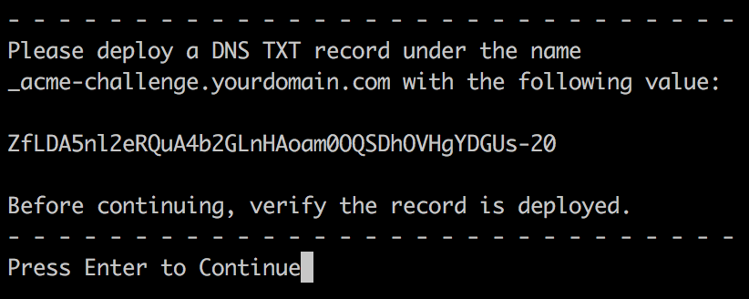
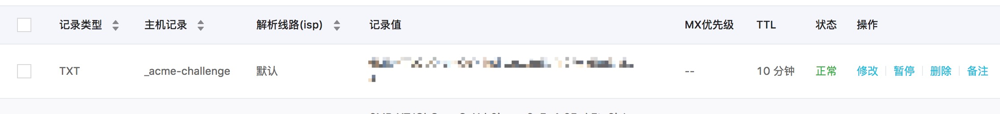

## Ubuntu(16.04 64位)安装Nginx
方法一：
1. `apt-get update`
2. `apt-get install nginx`
3. `nginx -V`
```
nginx version: nginx/1.14.0 (Ubuntu)
built with OpenSSL 1.1.0g  2 Nov 2017
TLS SNI support enabled
configure arguments: --with-cc-opt='-g -O2 ...
```

方法二：
1. `cd /usr/local/src`
2. `wget http://nginx.org/download/nginx-1.14.0.tar.gz`
3. `tar -xzf nginx-1.14.0.tar.gz`
4. `apt-get update`
5. `apt-get install gcc libpcre3 libpcrecpp0v5 libpcre3-dev libssl-dev`
6. `./configure --prefix=/usr/local/nginx --with-http_ssl_module --with-http_sub_module --with-http_gzip_static_module --with-http_stub_status_module`
7. `make`
8. `make install`
9. `cd /usr/local/nginx`
10. `./nginx`  启动nginx服务
11. `ps -ef|grep nginx` 查看nginx进程
## 安装Let's Encrypt
[Let's Encrypt](https://letsencrypt.org/getting-started/)
1. [Choose the Software and System](https://certbot.eff.org/)
2. Choose `Nginx` and `Ubuntu 16.04` 
3. `apt-get update`
4. `apt-get install software-properties-common`
5. `add-apt-repository ppa:certbot/certbot`
6. `apt-get update`
7. `apt-get install python-certbot-nginx`
8. nginx被重新覆盖了，安装后的位置在`/etc/nginx`
#### 单域名证书
* `certbot --nginx` 根据提示输入邮箱、域名后，生成证书成功
* `cd /etc/letsencrypt/live/` 生成的证书就在其中

#### 通配符域名证书
[changing the acme server](https://certbot.eff.org/docs/using.html#changing-the-acme-server)
* `certbot certonly  -d *.yourdomain.com --manual --preferred-challenges dns --server https://acme-v02.api.letsencrypt.org/directory`<br>
* `certonly`，表示安装模式，Certbot有安装模式和验证模式
* `-d`，域名申请，如果有多个域名，可以用逗号(,)分隔开，通配符域名则是`*.yourdomain.com`
* `--preferred-challenges`，选择证书验证方式
* `--server`，使用`https://acme-v02.api.letsencrypt.org/directory`就可以获取通配符域名证书

需要配置`DNS Text`记录来验证这个域名是否是申请者所有。<br>
如果使用的是阿里域名，在[阿里云管理后台界面](https://dns.console.aliyun.com/#/dns/domainList)下进行如下操作：

在配置完成后，可以先使用`dig  -t txt  _acme-challenge.yourdomain.com`进行校验是否已生效。<br>
如果配置已生效，则继续证书申请，`Press Enter to Continue`。
## 参考资料
[Let's Encrypt doc](https://certbot.eff.org/docs/using.html)<br>
[Let's Encrypt 终于支持通配符证书了](https://www.jianshu.com/p/c5c9d071e395)