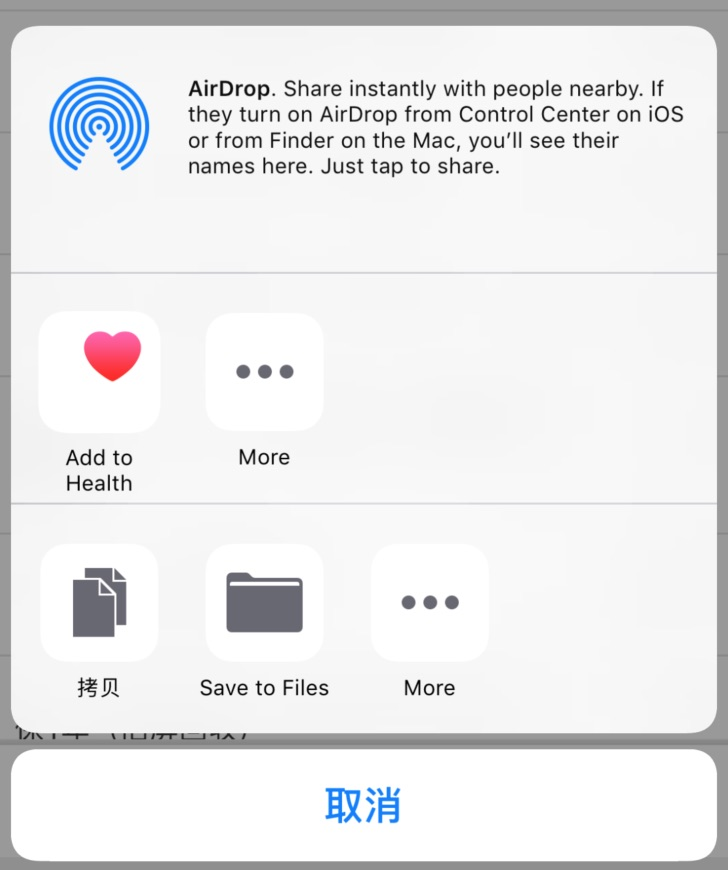
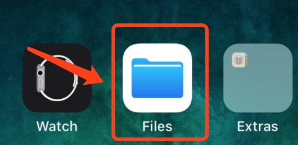
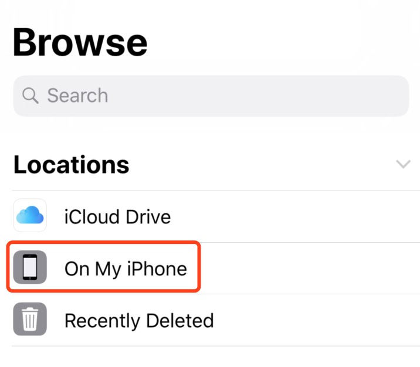
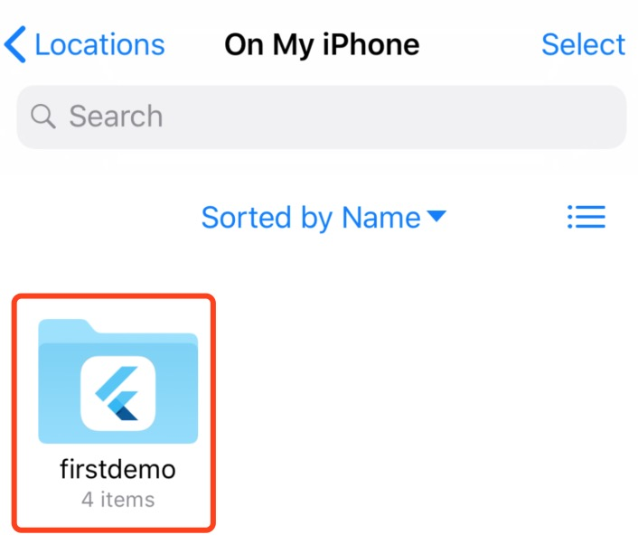

# iOS的文件分享功能

### 通过UIActivityViewController分享
在iOS中，可以通过FileManager获取文件在沙盒中的路径
```
let directoryURLs = FileManager.default.urls(
    for: FileManager.SearchPathDirectory.cachesDirectory, 
    in: FileManager.SearchPathDomainMask.userDomainMask)
let filename = "test.pdf" //文件名如果包含中文，需要encode，否则无法生成URL路径
let fileUrl = directoryURLs[0].appendingPathComponent(filename)
let activityVC = UIActivityViewController(activityItems: [fileUrl], applicationActivities: nil)
activityVC.popoverPresentationController?.permittedArrowDirections = .up // 显示AirDrop分享
viewController.(activityVC, animated: true, completion: nil)
```
<br>
### 将文件下载到Files应用中，然后通过在应用中分享。
iOS11添加一个新的系统应用`Files`，中文名为`文件`，可以查看`iCloud`中的文件，也可以查看应用沙盒中Documents中的文件。<br>
<br>
在`info.plist`中，添加`Supports Document Browser`，并置为`YES`。<br>
<br>
<br>
<br>
必须将文件写入到`Documents`目录下或目录下文件夹中，才能在`On My iPhone`中查看。